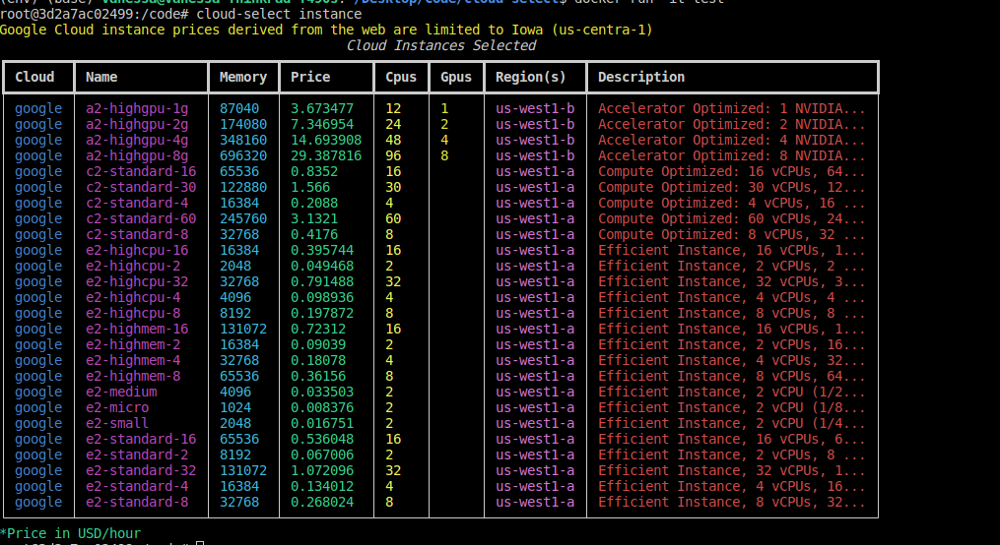
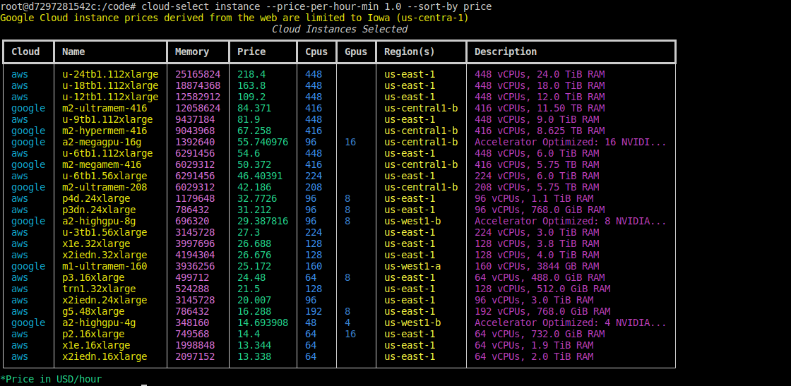
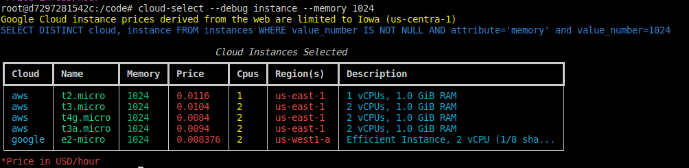

# Tutorials

This is a set (will be a set) of tutorials to help you get started with cloud select!

## Selector Tutorial

A selector is a class within cloud select that makes it easy to provide an interactive
(or otherwise programmatic) interface to use in your Python code to choose resources.
As an example, let's create a selector to help us choose an AWS instance.

```python
from cloudselect.main.selectors import InstanceSelector
selector = InstanceSelector(cloud="aws")
```
For the time being, a selector can target one cloud, however this
can easily be extended to include across clouds (open an issue with your use case)!
Next, let's say we want to filter based on resources memory and cpus. One option could
be to do this:

```python
resources = {"memory": 4000, "cpus": 1}
```

But you'll find you get a much better selection when you provide a small range, e.g.,:

```python
resources = {"memory_min": 4000, "memory_max": 4500, "cpus_min": 1, "cpus_max": 3}
```

Since the default "sort by" field that we try to optimize for is price, the smallest
resource specs will generally be shown first. Let's provide that to our function,
first in an interactive mode:

```python
instance = selector.select_instance(resources)
```
```console
 Please choose an instance type, these are sorted by price, least to greatest.

 =>      t4g.medium 2 vCPUs, 4.0 GiB RAM at 0.0336 $/hour
         t3a.medium 2 vCPUs, 4.0 GiB RAM at 0.0376 $/hour
         m6g.medium 1 vCPUs, 4.0 GiB RAM at 0.0385 $/hour
          t3.medium 2 vCPUs, 4.0 GiB RAM at 0.0416 $/hour
        m6gd.medium 1 vCPUs, 4.0 GiB RAM at 0.0452 $/hour
          t2.medium 2 vCPUs, 4.0 GiB RAM at 0.0464 $/hour
           a1.large 2 vCPUs, 4.0 GiB RAM at 0.051 $/hour
          c6g.large 2 vCPUs, 4.0 GiB RAM at 0.068 $/hour
          c7g.large 2 vCPUs, 4.0 GiB RAM at 0.0725 $/hour
          c6a.large 2 vCPUs, 4.0 GiB RAM at 0.0765 $/hour
         c6gd.large 2 vCPUs, 4.0 GiB RAM at 0.0768 $/hour
          c5a.large 2 vCPUs, 4.0 GiB RAM at 0.077 $/hour
          c6i.large 2 vCPUs, 4.0 GiB RAM at 0.085 $/hour
           c5.large 2 vCPUs, 4.0 GiB RAM at 0.085 $/hour
         c5ad.large 2 vCPUs, 4.0 GiB RAM at 0.086 $/hour
         c6gn.large 2 vCPUs, 4.0 GiB RAM at 0.0864 $/hour
          c5d.large 2 vCPUs, 4.0 GiB RAM at 0.096 $/hour
         c6id.large 2 vCPUs, 4.0 GiB RAM at 0.1008 $/hour
         c6in.large 2 vCPUs, 4.0 GiB RAM at 0.1134 $/hour
    Exit and start over
```

And then the instance is returned:

```python
instance
't4g.medium'
```

If there are no matches, `None` is returned. However,
if you provide a default, this will be shown to the user as the first option
and will be returned if there are no matches:

```python
instance = selector.select_instance(resources, default='my-custom-instance')
```
```
# after I chose default
instance
`my-custom-instance`
```

By default, we are setting the following parameters:

 - **interactive** (True) means that the user will be asked to choose an option from the list (shown above)
 - **allow_exit** (True) always give the user an option to exit to start over.
 - **sort_by** (price) A field from cloud select to sort by (defaults.sort_by_fields)
 - **ascending** (True) Return results with lowest price (or sort by field) at the top


If you set interactive to False, you'll get back the list of top results to handle yourself:

```python
instances = selector.select_instance(resources, interactive=False)
```
```console
[{'cloud': 'aws',
  'name': 't4g.medium',
  'memory': 4096,
  'price': 0.0336,
  'cpus': 2,
  'gpus': None,
  'region': 'us-east-1',
  'description': '2 vCPUs, 4.0 GiB RAM'},
 {'cloud': 'aws',
  'name': 't3a.medium',
  'memory': 4096,
  'price': 0.0376,
  'cpus': 2,
  'gpus': None,
  'region': 'us-east-1',
  'description': '2 vCPUs, 4.0 GiB RAM'}]
  ...
```

And that's it! This class should make it easy to add a cloud select process
to your own Python modules. If you have a feature request or other item
to discuss, please [let us know](https://github.com/converged-computing/cloud-select/issues).

## Docker Tutorial

The easiest way to jump in is with docker. We provide a [pre-built container](https://github.com/converged-computing/cloud-select/pkgs/container/cloud-select):

```bash
$ docker run -it ghcr.io/converged-computing/cloud-select
```

And note this will eventually have versioned releases.  Running the container
will put you in an environment where the latest version of cloud-select is
installed:

```bash
$ which cloud-select
```
```console
/opt/conda/bin/cloud-select
```

### Basic Queries

Then try asking to query instances, with no arguments. This first call will use our container nightly cache provided at
[ghcr.io/converged-computing/cloud-select](https://github.com/converged-computing/cloud-select-cache/pkgs/container/cloud-select-cache)
and download to your host at `~/.cloud-select/cache`. This by default will present 25 results in the order
returned by the database.

```console
# cloud-select instance
```



Try asking for more results:

```bash
$ cloud-select --max-results 100 instance
```

Or try filtering by price:

```bash
$ cloud-select instance --price-min 1.0
```

And also sorting, of course, either default or ascending:

```bash
$ cloud-select instance --price-min 1.0 --sort-by price
$ cloud-select instance --price-min 1.0 --sort-by price --asc
```



Or limit to one cloud (on the fly):

```bash
$ cloud-select instance --cloud aws
```

Note that you can always change this to a default
via the `settings.yml` in the install root. You can also create your own version
to tweak in your home via:

```bash
$ cloud-select config inituser
$ cloud-select config edit # uses vim, haarhar
```

### Advanced Queries

There are two types of attribute queries - asking for a specific value verbatim,
or a range. Here is asking for an exact match:

```bash
$ cloud-select instance --memory 1024
```

Try adding `--debug` to see debug information (this works generally for any command) and for an
instance query it shows the database query!


```bash
$ cloud-select --debug instance --memory 1024
```



If you are curious, we create an in-memory database each time from the cache data
to do the queries. It might be faster to save it to the filesystem and
not have to re-create it, but I haven't added that yet.
Next, let's try a range query:

```bash
$ cloud-select --debug instance --memory-min 1024 --memory-max 8000
```

This might nbe a more realistic query you would do:

```bash
$ cloud-select --debug instance --memory-min 1024 --memory-max 8000 --sort-by price --asc
```

You can see all the attributes available for query with `cloud-select --help`. Note
that not all instances support all attributes. E.g.,:

```bash
$ cloud-select --debug instance --gpu-memory-min 8000
GoogleCloudInstance does not support getting information about range:gpu_memory. Set allow_missing_attributes in your settings.yml to 'true' to continue anyway.
```
In the above, Google Cloud doesn't have this information. So we need to explicitly say "that's OK"

```bash
$ cloud-select -c set:allow_missing_attributes:true --debug instance --gpu-memory-min 8000
```

The `-c` flag is a one off config setting - here we are saying to set that particular setting to true. The
result will return a table with only AWS (the query doesn't select any Google).

Finally, to include / exclude instance names, you can provide a regular expression via
`--include-list` or `--exclude-list`. Here we show including e2 prefix instances:

```bash
$ cloud-select --debug instance --include-list e2
```
```console
SELECT DISTINCT cloud, instance FROM instances WHERE instance REGEXP 'e2'
```

And excluding them:

```bash
$ cloud-select --debug instance --exclude-list e2
```
```console
SELECT DISTINCT cloud, instance FROM instances WHERE NOT instance REGEXP 'e2'
```

## Database Tutorial

If you consider yourself an "advanced" user and want a direct interface
to the in memory sqlite database, you can use the `dbshell` function:

```bash
$ cloud-select dbshell
```
```console
Table prepared for you:

CREATE TABLE IF NOT EXISTS instances (
    id integer PRIMARY KEY,
    cloud text NOT NULL,
    instance text NOT NULL,
    attribute text NOT NULL,
    value text NULLABLE,
    value_bool number NULLABLE,
    value_number number NULLABLE
);
```

This will prepare the same database for you as used in the command line
client, but allow you to write your own queries without needed to re-create the
database each time. You'll find the `db` instance prepared in the shell context:

```python
In [1]: db
Out[1]: <cloudselect.main.solve.database.Database at 0x7f83966b02e0>
```

Let's try some basic queries using the table above! Note that the results
returned are the raw data, where each row is just one attribute and value
for a particular instance type and cloud. This means the same instance
is represented multiple times (one time for each attribute) across the database.
When you are using the client, this data is reassembled into a final result.
When you do the raw queries on your own, that's up to you!
Also note that the database has an added function `REGEXP` for regular expression type queries.

### Get Attributes

What attributes are available for query (aside from exact fields shown above)? Let's ask!

```python
> attributes = db.execute("SELECT DISTINCT attribute from instances")
```
```console
[('cpu_arch',),
 ('cpus',),
 ('description',),
 ('disk_type',),
 ('free_tier',),
 ('gpu',),
 ('gpu_memory',),
 ('gpu_model',),
 ('gpu_vendor',),
 ('gpus',),
 ('hypervisor',),
 ('instance_storage',),
 ('ipv6',),
 ('memory',),
 ('memory_bytes',),
 ('price',),
 ('spot_price',),
 ('region',),
 ('zone',)]
```

Each of the above is either a number or a string, or a boolean (which is just an integer).
Every row has an attribute field, but then either has one of a number (value_number), string value (value), or boolean (value_bool). We will show you how to query for each.

### Field Matches

The following examples are looking for exact matches for a known database attribute.
First, here is cloud:

```python
> aws_instances = db.execute("SELECT * from instances where cloud = 'aws'")
```
```console
(985, ..., 'aws', 'i3en.2xlarge', 'disk_type', 'ssd', None, None),
(986, ..., 'aws', 'i3en.2xlarge', 'free_tier', None, 0, None),
(987, ..., 'aws', 'i3en.2xlarge', 'hypervisor', 'nitro', None, None),
```

Note that the second field (left out) is the "cloud select id," a long identifier
that is a basic hash of the instance data that can get us back to it. We will leave it
out for the remainder of these examples. Here is querying for an instance name:

```python
> high_cpus = db.execute("SELECT * from instances where instance = 'n2d-highcpu-224'")
```
```console
 (23252, ..., 'google', 'n2d-highcpu-224', 'price', None, None, 6.986112),
 (23254, ..., 'google', 'n2d-highcpu-224', 'region', 'us-west1-a', None, None),
 (23255, ..., 'google', 'n2d-highcpu-224', 'zone', 'us-west1-a', None, None)]
```
Since this is the exact name of a google instance type, the query above inadvertently
filters down to only Google too. Each row in the result is a particular
kind of result. The field the value is in (e.g., notice all the None?) depends on
the type, which we will talk about next.


### Attribute String Matches

Let's say we now want to query an attribute, and the attribute is a string.
This value will be found in the vanilla `value` field, so we want to check
that is not None, and that it equals our query. Here is an example that checks
for a region:

```python
> east_instances = db.execute("SELECT * from instances where attribute = 'region' and value NOT NULL AND value = 'us-east-1'")
```

### Attribute Boolean Matches

A boolean in the database is actually just an integer with values 0 (false) and 1 (true).
If we want to find instances that support gpu (where gpu == True) we might do:

```python
> gpu_supported = db.execute("SELECT * from instances where attribute = 'gpu' and value_bool NOT NULL AND value_bool = 1")
```
```
(19011, 'google', 'a2-highgpu-2g', 'gpu', None, 1, None),
(19023, 'google', 'a2-highgpu-4g', 'gpu', None, 1, None),
(19035, 'google', 'a2-highgpu-8g', 'gpu', None, 1, None)]
```

### Attribute Number Matches

Now let's say we are interested in an exact number, maybe the number of GPU.

```python
> gpu_instances = db.execute("SELECT * from instances where attribute = 'gpus' and value_number NOT NULL AND value_number = 4")
```
```console
[(1543, ..., 'aws', 'g4dn.12xlarge', 'gpus', None, None, 4),
 (2230, ..., 'aws', 'g4ad.16xlarge', 'gpus', None, None, 4),
 (3340, ..., 'aws', 'g5.24xlarge', 'gpus', None, None, 4),
 (4213, ..., 'aws', 'g3.16xlarge', 'gpus', None, None, 4),
 (4257, ..., 'aws', 'g5.12xlarge', 'gpus', None, None, 4),
 (4750, ..., 'aws', 'p3.8xlarge', 'gpus', None, None, 4),
 (7392, ..., 'aws', 'g2.8xlarge', 'gpus', None, None, 4),
 (7683, ..., 'google', 'a2-highgpu-4g', 'gpus', None, None, 4),
 (12117, ..., 'google', 'a2-highgpu-4g', 'gpus', None, None, 4),
 (12173, ..., 'google', 'a2-ultragpu-4g', 'gpus', None, None, 4),
 (13820, ..., 'google', 'a2-highgpu-4g', 'gpus', None, None, 4),
 (15605, ..., 'google', 'a2-highgpu-4g', 'gpus', None, None, 4),
 (17239, ..., 'google', 'a2-highgpu-4g', 'gpus', None, None, 4),
 (19024, ..., 'google', 'a2-highgpu-4g', 'gpus', None, None, 4)]
```

We can also use greater than or less than statements - these coincide to min/max args from the command line.

```python
> gpu_instances = db.execute("SELECT * from instances where attribute = 'gpus' and value_number NOT NULL AND value_number > 6 and value_number < 10")
```
### Regular Expressions

If you want to match a string field that is "like" or "unlike" something, or since we are talking
about Python, you want to use a regular expression, the database has support for that with
a function we added called `REGEXP`. Here is looking for instances with e2 in the name:

```python
> e2_instances = db.execute("SELECT DISTINCT instance from instances where instance REGEXP 'e2'")
```
```console
[('e2-highcpu-16',),
 ('e2-highcpu-2',),
 ('e2-highcpu-32',),
 ('e2-highcpu-4',),
 ('e2-highcpu-8',),
 ('e2-highmem-16',),
 ('e2-highmem-2',),
 ('e2-highmem-4',),
 ('e2-highmem-8',),
 ('e2-medium',),
 ('e2-micro',),
 ('e2-small',),
 ('e2-standard-16',),
 ('e2-standard-2',),
 ('e2-standard-32',),
 ('e2-standard-4',),
 ('e2-standard-8',)]
```
or the negation.

```python
> not_e2_instances = db.execute("SELECT DISTINCT instance from instances where NOT instance REGEXP 'e2'")
```
```console
...
 ('t2a-standard-1',),
 ('t2a-standard-16',),
 ('t2a-standard-2',),
 ('t2a-standard-32',),
 ('t2a-standard-4',),
 ('t2a-standard-48',),
 ('t2a-standard-8',),
 ('m2-ultramem2x-96',),
 ('m2-ultramemx-96',)]
...
```

Note that this works for any regular expression in Python.

```python
> matches = db.execute("SELECT DISTINCT instance from instances where instance REGEXP '^a[0-9]-ultra*'")
```
```console
[('a2-ultragpu-1g',),
 ('a2-ultragpu-2g',),
 ('a2-ultragpu-4g',),
 ('a2-ultragpu-8g',)]
```

### Distinct

When you want to get the final or exact results, there are a few ways to go about it. If you are interested in a general query you could use distinct, and not on the attribute values, but rather the attributes of the instances that make them unique. E.g., if you just want to know the distinct
cloud and instance names:

```python
> aws_instances = db.execute("SELECT DISTINCT cloud, instance from instances where cloud = 'aws'")
```
```console
 ('aws', 'm6g.large'),
 ('aws', 'im4gn.16xlarge'),
 ('aws', 'x2iedn.2xlarge'),
 ('aws', 'c6id.4xlarge'),
 ('aws', 't3.large')]
```
The issue is that this might leave out information, for example, that the different types can have
different regions or memory. Toward this aim, this is where the cloud select id comes into play!
Let's say we filter down to get cloud and cloud select identifier:

```python
> instances = db.execute("SELECT DISTINCT cloud, cloudselect_id from instances where cloud = 'aws'")
```
```console
 ('aws', -6470275901068330612),
 ('aws', -5390373463532400622),
 ('aws', 6268216186745007458)]
```
The result looks weird, but our instances client knows how to handle it!

```python
for item in instances:
    # unwrap to the cloud and uid
    cloud, uid = item
    print(client.groups[cloud].generate_row(uid))
```
```console
{'cloud': 'aws', 'name': 'c6id.4xlarge', 'memory': 32768, 'price': 0.8064, 'cpus': 16, 'gpus': None, 'region': 'us-east-1', 'description': '16 vCPUs, 32.0 GiB RAM'}
{'cloud': 'aws', 'name': 't3.large', 'memory': 8192, 'price': 0.0832, 'cpus': 2, 'gpus': None, 'region': 'us-east-1', 'description': '2 vCPUs, 8.0 GiB RAM'}
```

That will be populated with prices (or not) depending on their availability and if you
have not disabled adding prices in your user settings.


**Note** We are still working on the client, and we don't have tests for a lot of
functionality (yet) so it's use at your own risk! We are thinking about
use cases and if you have ideas please [contribute them here](https://github.com/converged-computing/cloud-select/issues/14).
